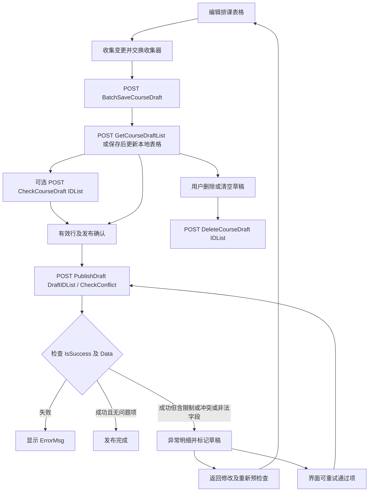
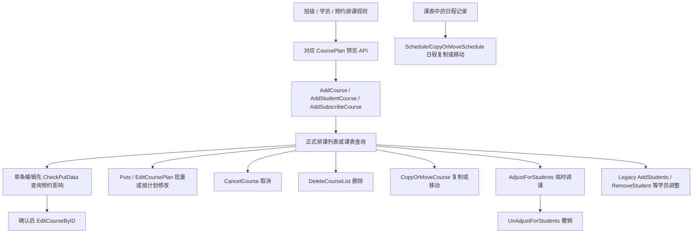
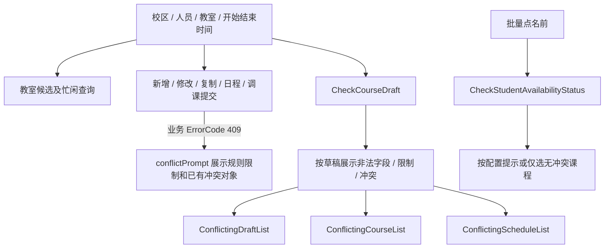
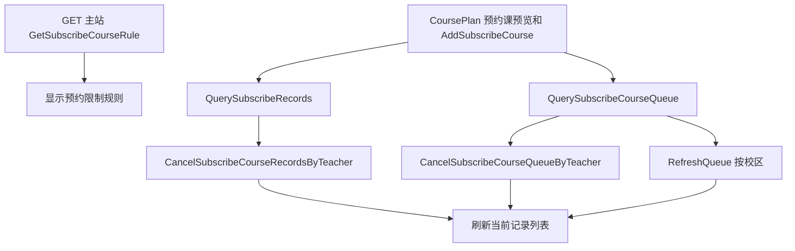

# 排课 API 工作流

- 分析日期：2026-10-07。
- 源码：`li281077304-boop/blog/main`，HEAD `5561802e8fc2ed699f30abc59e5e942269660db2`，范围 `wtwo/`。
- 静态前端分析；所有流程描述这一版本的界面调用关系，没有请求线上 API。[固定版本源码](https://github.com/li281077304-boop/blog/tree/5561802e8fc2ed699f30abc59e5e942269660db2/wtwo)。
- 路径行号为 `wtwo/` 相对路径。下文 `C` = 环境 apiUrl + `/api/course`；`L` = 页面同源 Legacy 路径。接口名不能证明当前上线状态；服务器内部算法和事务边界未知。

## 1. 草稿链

GetCourseDraftList 是载入/刷新已有草稿入口，保存成功也会更新本地数据；源码并未要求每次保存后固定调用 GetCourseDraftList。DeleteCourseDraft 是删除/清空操作，**不是已证实的每次发布自动清理步骤**。

| 步骤 | API/方法 | 结构/前端证据 |
|---|---|---|
| 保存 | POST `C/CourseDraft/BatchSaveCourseDraft` | API `src/api/arrange.ts:138-142`；表格 `src/pages/scheduleManage/tableCourseSchedule/class-table/class-table-course.vue:968-1012` 原子交换变更收集器后提交 changes（数组），新增有 IsNew；页面依据 IsSuccess 判断保存，并处理验证错误。 |
| 载入 | POST `C/CourseDraft/GetCourseDraftList` | `arrange.ts:160-164`；表格 `:1818-1839` 请求 CourseMethod；读取 Data.SavedDraftList、Data.SaveErrorList，以及逐字段 FieldName 错误。 |
| 预检查 | POST `C/CourseDraft/CheckCourseDraft` | `arrange.ts:338-342` 请求 IDList；表格 `:7119-7160` 按 DraftId 储存结果、映射 ErrorFieldList/CheckFieldList/ConflictFieldList；独立检查弹窗 `components/check-course-draft/check-course-draft-dialog.vue:110-129`。 |
| 发布 | POST `C/CourseDraft/PublishDraft` | `arrange.ts:563-567`；表格 `:6610-6616` 发 DraftIDList、CheckConflict；具名模型 `src/types/model/table-course-class.ts:113-141`。 |
| 删除 | POST `C/CourseDraft/DeleteCourseDraft` | `arrange.ts:146-151`；表格 `:6247` 删勾选项，`:6805` 是另一个清空草稿调用；不能据此断言服务器发布后是否删除原草稿。 |

### 发布结果与风险边界

`class-table-course.vue:6636-6683` 明确区分：

- IsSuccess false：直接提示失败；
- IsSuccess true 且 Data 为空或各项都无问题：完成；
- IsSuccess true 但 Data 有问题：展示异常，不可把 IsSuccess 单独视为全部排课成功。

问题模型为 DraftId、ErrorFieldList（非法字段）、CheckFieldList（规则限制）、ConflictFieldList（资源/时间冲突）。ConflictFieldList 含 ConflictingDraftList、ConflictingCourseList、ConflictingScheduleList；字段见 `src/types/model/table-course-class.ts:128-170`，页面解析见 `class-table-course.vue:6689-6730`。

界面“仅处理通过项”重试路径提交 remainingIds 与 CheckConflict:0（`:6868-6870`），发布确认控件有 `NewCourse_IngoreCourseConflict` 判断（`src/pages/scheduleManage/popup/CourseDraftPublishDialog.vue:107`）。这是原系统 UI 行为痕迹，不能推断后台允许普通用户关闭检查，也不能证明首次提交/重试的幂等性、部分成功事务和失败项保留语义。后续须以用户合法操作 Network 观察确认。

共用 handler 先要求 ErrorCode 200 才把响应交给页面（`src/api/handler.ts:22`），草稿页却读取 IsSuccess。真实响应是否同时包含二者是优先补充点。

## 2. 正式排课链

图是操作分支总览。单条编辑顺序是 **准备参数 → CheckPutData → 有预约则确认 → EditCourseByID**；各分支是不同操作入口，不要求依次执行。

| 操作 | 路径/方法 | 调用证据及字段结构 |
|---|---|---|
| 班级新增 | POST `C/CoursePlan/AddCourse` | `src/api/arrange.ts:122`；`src/pages/scheduleManage/popup/addArrangeForm.vue:231-249` 带 CheckConflict；isEdit 改走 EditCoursePlan。 |
| 学员新增 | POST `C/CoursePlan/AddStudentCourse` | `arrange.ts:286`；addArrangeForm `:265-283`。 |
| 预约课新增 | POST `C/CoursePlan/AddSubscribeCourse` | `arrange.ts:320`；addArrangeForm `:298-317`。这是新增可预约课时段，不能等同“替学员创建预约记录”。 |
| 计划预览 | POST `C/CoursePlan/GetCoursePlanPreview`、`GetStudentCoursePlanPreview`、`GetSubscribeCoursePlanPreview` | `arrange.ts:541-558`；对应按规则新增班级/学员/预约预览。参数 any，不宣称后台算法完整。 |
| 单条修改 | GET `C/Course/CheckPutData`；POST `C/Course/EditCourseByID` | `arrange.ts:245,295`；editArrangeForm `:1780-1819` 用 id 查预约，ErrorMsg == 1 时弹窗提醒人工通知，再提交；包含 CourseExSettings、CheckConflict、IsPostpone、IsCover（`:1767-1777`）。 |
| 批量修改 | POST `C/Course/Puts` | `arrange.ts:484`；`src/pages/scheduleManage/popup/batchEditCourse.vue:473,530`，带 CheckConflict。 |
| 按计划修改 | POST `C/CoursePlan/EditCoursePlan` | `arrange.ts:768`；addArrangeForm 各模式的 isEdit 分支。 |
| 取消 | POST `C/Course/CancelCourse` | `arrange.ts:385-389`；取消是状态行为，与物理删除分开。取消后的内容修改另见 `C/Course/PutContent`（`:393`）。通知、撤回和费用影响不能仅凭前端证明。 |
| 删除 | POST `C/Course/DeleteCourseList` | `arrange.ts:361`；`src/pages/scheduleManage/popup/arrangeInfo.vue:1225`、`arrangeTableList/arrangeTableList.vue:1675`。Legacy POST `/api/Course/Delete_Ask`（`:369`）是删除申请痕迹，不能默认所有删除都必经审批。 |
| 复制/移动 | POST `C/Course/CopyOrMoveCourse` | `arrange.ts:466`；copyArrageCourse `:1082-1095` 请求 CheckConflict、CopyOrMove、CourseList；每项包含 CourseID 与 DateList 的 StartTime/EndTime。拖拽确认也调用此接口（`arrangeCanlendar/popup/courseDragConfirmDialog.vue:228`）。 |
| 日程复制/移动 | POST `C/Schedule/CopyOrMoveSchedule` | 独立于 Course/CopyOrMoveCourse；`src/api/arrange.ts:475-480`。调用页 `src/pages/scheduleManage/arrangeCanlendar/popup/scheduleDragConfirmDialog.vue:240-256` 发 ScheduleList（ID、DateList 中 StartTime/EndTime）、CheckConflict、CopyOrMove，并处理业务 409。这里只证明日程拖拽确认的请求关系，不能确认其是否修改整个计划或关联课程。 |
| 临时调课 | GET `C/Course/GetStudentsForAdjustCourse`；Legacy POST `/api/Shift/AdjustCourseGetShifts`；POST `C/Course/AdjustForStudents` | `arrange.ts:571-591`；adjustCourse `:572-576` 发 FromCourseID、ToCourseID、StudentIDList、IsCheckConflict。不是直接修改所有班级成员原课表。 |
| 撤销调课 | POST `C/Course/UnAdjustForStudents` | `arrange.ts:596`；adjustedStudents `:87-90` 发 CourseID、StudentID、IsCheckConflict。 |
| 添加/移除学员 | Legacy POST `/api/Course/AddStudents`、`/api/Course/RemoveStudent` | `arrange.ts:177,197`；arrangeInfo `:1573,1624`。另有 `/api/course/ReduceStudents`、`RemoveAdjustOrTryStudents`（`:185-193`），具体账务/试听影响模型不完整。 |

新增/修改/复制/临时调课函数通过 `code:[409]` 让调用页接收业务冲突并显示 conflictPrompt（arrange.ts 对应函数）；服务器的 HTTP status 与响应 ErrorCode 不应混为一谈。

## 3. 资源冲突链

| 冲突维度 | 证据 | 可确认范围 |
|---|---|---|
| 学员 | `src/api/arrange.ts:605-608`；`arrangeTableList.vue:1542-1556` | CheckStudentAvailabilityStatus 请求 CourseIDList，返回冲突课程；示例场景是批量点名，不应泛化为所有新增表单预先调用此 API。 |
| 教室 | `arrange.ts:303-315`；`src/components/business/select/classroom-select.vue:481-523` | GetClassRoomAvailabilityStatus / ByPlan；字段 CampusID、IDList、IsIncludeStatus、StartTime/EndTime 或 customParams 计划；Status == 1 解释为闲，其他为忙（这是 UI 解释）。 |
| 任课老师/助教 | `src/pages/scheduleManage/popup/conflictPrompt.vue:106-134`；`src/types/model/table-course-class.ts:176-239` | 冲突详情包含 MainTeacherList、AssistantTeacherList，页面按 ConflictFieldList 高亮。不据此虚构独立“教师冲突查询” API。 |
| 草稿与正式课程 | `src/types/model/table-course-class.ts:160-164`；class-table-course `:6645-6647` | ConflictingDraftList / ConflictingCourseList 独立分组。 |
| 日程 | `src/types/model/table-course-class.ts:168`；`src/api/arrange.ts:677,710,719` | ConflictingScheduleList；AddSchedulePlan、EditSchedule、EditSchedulePlan 也声明处理 409。日程可与排课共享资源。 |
| 规则限制与非法字段 | `class-table-course.vue:6699-6730`；`conflictPrompt.vue:13-37` | 规则限制不等于时间冲突；合法性 ErrorFieldList 与限制 CheckFieldList 不应归并。正式流程异常结构还有 CheckSum、ConflictSum、ConflictDataList，不能强制套用草稿 DTO。 |

助教是否纳入冲突检查有配置 `CheckAssistantConflict`（`popup/child/addClassArrangeForm.vue:1950-1961` 等）。此外权限能控制 UI 的 CheckConflict 选项；后端真正的资源判定规则、时间边界、跨校区教师、重复事件展开、冲突优先级未知。

## 4. 预约课链

规则读取：GET `/api/SubscribeCoursePlan/GetSubscribeCourseRule`（`arrange.ts:777-780`），`popup/child/subscribeRuleSet.vue:321-336` 消费 MaxDays、ApplyBeforeHours、CancelBeforeHours、LimitType、LimitShift、LimitMaxCount、AutoCancelHours、SkipConflict、StudentStatus、IsQueue、ShowRule、ShowStudentCount。这里只能确认字段及前端解释，不能还原真实排队算法。规则保存函数调用在 `:386-406` 是**注释**；没有对应有效 API 定义，必须列为缺失链接。

预约/排队查询：POST `C/SubscribeCourse/QuerySubscribeRecords` / `QuerySubscribeCourseQueue`（`arrange.ts:434-453`）；`popup/arrangeSubscribeRecord.vue:498-523` 用 tab 切换，发分页、StartTime/EndTime、StudentUserID、EmployeeIDList、CampusIDList，读取 Data.List 与分页。两者另有 Blob 导出，但本轮不请求。

老师取消：POST `C/SubscribeCourse/CancelSubscribeCourseRecordsByTeacher` / `CancelSubscribeCourseQueueByTeacher`（`arrange.ts:213-226`），`arrangeSubscribeRecord.vue:625-641` 请求 CancelReason、IsSendMsg，预约用 SubscribeCourseRecordsID，排队用 ID；成功刷新。

刷新队列：POST `C/SubscribeCourse/RefreshQueue`（`arrange.ts:493-497`），调用页 `:577-583` 请求 **campusIDList**（小写开头），成功刷新当前列表；不能擅自改成 CampusIDList 或当作只读请求。

**未找到完整链路**：学员端真正申请预约/入队操作、队列晋级触发器、自动取消定时任务、容量和费用扣减规则、通知实现、竞态和幂等保障。新增预约课时段与创建预约记录不能混淆。

## 5. 后续应补充的正常 Network 观察

优先只读观察 GetCourseDraftList、规则、课表/课程/预约列表、教室忙闲和 whoami 的脱敏结构。发布/删除/取消/刷新队列属写操作，本轮仅整理痕迹，未来也只能在用户已授权的正常业务操作中被动记录。重点补充 IsSuccess 与 ErrorCode 关系、部分成功的含义、正式/草稿冲突结构差异、CopyOrMove 的枚举、日程与课程关联、StudentID/UserID 映射及预约检查 ErrorMsg == 1 的实际类型。任何 Cookie/Token/SID/学员或教师个人数据值不得进入 GitHub。
